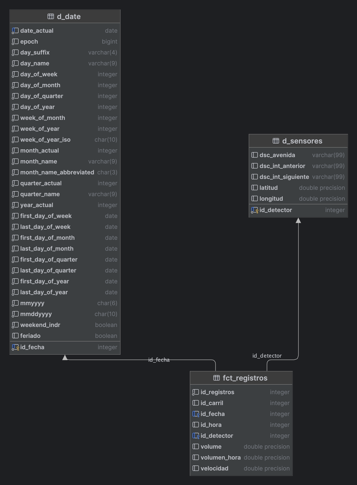

```{r setup, include=FALSE}
knitr::opts_chunk$set(echo = FALSE)
```

```{r Librerias , include = FALSE}
library(magrittr)
library(dplyr)
library(tidyr)
library(forcats)
library(ggplot2)
library(DBI)
library(RPostgres)
library(sf)
library(leaflet)
library(paletteer)
library(geouy)
library(spdep)
library(leaflet)
source(here::here("app", "utils.R"))
```

```{r Variables de Entorno, eval=FALSE, echo=FALSE}
usethis::edit_r_environ(
  scope = "project"
)
```

# Introducción

Datos de trafico

# Datos

## Descripción general de los datos

Los datos utilizados son estos

-   [Conteo vehicular en las principales avenidas de Montevideo](https://catalogodatos.gub.uy/dataset/intendencia-montevideo-conteo-de-vehiculos-del-centro-de-gestion-de-la-movilidad)
-   [Velocidad promedio vehicular en las principales avenidas de Montevideo](https://catalogodatos.gub.uy/dataset/intendencia-montevideo-velocidad-promedio-vehicular-en-las-principales-avenidas-de-montevideo)
-   [Ubicación de sensores de medición de conteo vehículos](https://catalogodatos.gub.uy/dataset/intendencia-montevideo-ubicacion-de-sensores-de-medicion-de-conteo-vehiculos)
-   [Semaforos](https://geoweb.montevideo.gub.uy/geonetwork/srv/spa/catalog.search#/metadata/d2da8cdd-c718-4eeb-9825-7069498b29c2)

Todos provenientes de la intendencia de montevideo

### Observaciones

Los datos son mensuales. Van desde Enero 2021 hasta Abril 2023. Los datos de los semaforos son de septiembre del 2014

### Descripcion de variables

**Conjunto de datos: Conteo vehicular en las principales avenidas de Montevideo**

-   `cod_detector`: Entero - ID de la cámara que monitorea un carril específico para detectar vehículos.
-   `id_carril`: Entero - Número del carril monitoreado (1, 2, 3, ...).
-   `fecha`: AAAA-MM-DD - Día en que se realizó la medición.
-   `hora`: hh:mm:ss - Hora en que se realizó la medición.
-   `dsc_avenida`: Texto - Nombre de la avenida donde se mide el tráfico.
-   `dsc_int_anterior`: Texto - Nombre de la vía desde donde vienen los vehículos.
-   `dsc_int_siguiente`: Texto - Nombre de la vía hacia donde se dirigen los vehículos.
-   `latitud`: Float - Latitud del lugar de medición.
-   `longitud`: Float - Longitud del lugar de medición.
-   `volumen`: Entero - Cantidad de vehículos detectados en el carril en los últimos 5 minutos.
-   `volumen_hora`: Entero - Cantidad de vehículos detectados en el carril en la última hora.

**Conjunto de datos: Velocidad promedio vehicular en las principales avenidas de Montevideo**

-   `cod_detector`: Entero - ID de la cámara que monitorea un carril específico para detectar vehículos.
-   `id_carril`: Entero - Número del carril monitoreado (1, 2, 3, ...).
-   `fecha`: AAAA-MM-DD - Día en que se realizó la medición.
-   `hora`: hh:mm:ss - Hora en que se realizó la medición.
-   `dsc_avenida`: Texto - Nombre de la avenida donde se mide el tráfico.
-   `dsc_int_anterior`: Texto - Nombre de la vía desde donde vienen los vehículos.
-   `dsc_int_siguiente`: Texto - Nombre de la vía hacia donde se dirigen los vehículos.
-   `latitud`: Float - Latitud del lugar de medición.
-   `longitud`: Float - Longitud del lugar de medición.
-   `velocidad_promedio`: Entero - Promedio de las velocidades de los autos que circularon por el carril durante los últimos 5 minutos.

**Conjunto de datos: Ubicación de sensores de medición de conteo vehículos**

-   `dsc_avenida`: Texto - Nombre de la avenida donde se encuentra el sensor o cámara y donde se mide el tránsito.
-   `dsc_int_anterior`: Texto - Nombre de la vía que forma el cruce desde donde vienen los vehículos.
-   `dsc_int_siguiente`: Texto - Nombre de la vía que forma el cruce donde está el sensor. En general, el sensor se encuentra un poco antes de esta vía. El sentido de circulación será desde el cruce con `dsc_int_anterior` hacia el cruce con `dsc_int_siguiente`.
-   `latitud`: Float - Coordenada que indica la latitud de la ubicación del sensor.
-   `longitud`: Float - Coordenada que indica la longitud de la ubicación del sensor.

Sobre estos datos en particular, son *100 sensores* que se van cambiando de ubicacion mes a mes

## Base de Datos

Debido a que los datos utilizados, estan estrechamente relacionados y a su vez son sumamente masivos, hemos decidido utilizar una base de datos relacionales.

```{r Coneccion a Base de Datos}
con <- DBI::dbConnect(
  RPostgres::Postgres(),
  host = Sys.getenv("DB_HOST"),
  port = Sys.getenv("DB_PORT"),
  user = Sys.getenv("DB_USER"),
  password = Sys.getenv("DB_PASS"),
  dbname = Sys.getenv("DB_NAME")
)
```

{width="300" height="600"}

En la base de datos la tabla principal es `fct_registros`

### Tabla: fct_registros
- Cantidad de datos: 85386695
- Variables de la tabla:
  - *id_registros* (Primary Key)
  - id_carril
  - *id_fecha* -> d_date(*id_fecha*) (Foreign Key)
  - id_hora
  - *id_detector* -> d_sensores(*id_detector*) (Foreign Key)
  - volume
  - volumen_hora
  - velocidad
  
### Tabla: d_sensores
- Cantidad de datos: 273
- Variables de la tabla:
  - *id_detector* (Primary Key)
  - dsc_avenida
  - dsc_int_anterior
  - dsc_int_siguiente
  - latitud
  - longitud
  - barrio

### Tabla: d_date
- Cantidad de datos: 3652
- Variables de la tabla:
  - *id_fecha* (Primary Key)
  - date_actual
  - epoch
  - day_suffix
  - day_name
  - day_of_week
  - day_of_month
  - day_of_quarter
  - day_of_year
  - week_of_month
  - week_of_year
  - week_of_year_iso
  - month_actual
  - month_name
  - month_name_abbreviated
  - quarter_actual
  - quarter_name
  - year_actual
  - first_day_of_week
  - last_day_of_week
  - first_day_of_month
  - last_day_of_month
  - first_day_of_quarter
  - last_day_of_quarter
  - first_day_of_year
  - last_day_of_year
  - mmyyyy
  - mmddyyyy
  - weekend_indr
  - feriado


# Análisis exploratorio

```{r Cargar Mapas , sensores, semaforos, message=FALSE, results='hide'}
d_sensores <- DBI::dbGetQuery(
  con,
  "SELECT * FROM d_sensores"
  )
mvd_map <- load_geouy("Barrios")
mvd_map_fixed <- st_make_valid(st_transform(mvd_map, crs = 4326))
puntos_sensores <- d_sensores %>% 
  select(barrio, latitud, longitud) %>%
  mutate(transformarCoord(latitud, longitud, mvd_map))
capaSemafotos <- st_read(here::here('app',"data", "v_int_semaforos", "v_int_semaforos.shp"))

```

## Mapa de los datos

Los datos de los sensores no son de todos los barrios , sino que solamente alcanzan los siguientes barrios

```{r Cantidad de sensores por barrio}
(
  cant_sensores <- d_sensores %>% group_by(barrio) %>% 
    summarise(
      cant_de_sensores = n()
    ) %>% arrange(desc(cant_de_sensores))
)
```

Y en un mapa tambien se puede visualizar

```{r Mapa de concentracion de sensores}

mvd_map_sensores <- mvd_map_fixed %>% 
  left_join(cant_sensores, by = c("nombbarr" = "barrio")) %>%
  mutate(cant_de_sensores = ifelse(is.na(cant_de_sensores), 0, cant_de_sensores))

ggplot() +
  geom_sf(
    data = mvd_map_sensores,
    aes(
      fill = ifelse(cant_de_sensores == 0, NA, cant_de_sensores)
    )
  )+
  scale_fill_viridis_c(option = "plasma", name = "Cantidad de sensores por barrio") +
  theme_void() +
  theme(legend.position = "bottom")

```

\`\`\`

## Preguntas de investigación

1.  ¿Existe alguna correlación entre el volumen de tráfico y la velocidad promedio en las avenidas de Montevideo?
2.  ¿Cuáles son las avenidas con los mayores promedios de velocidad en Montevideo?
3. ¿Cómo va variando el volumen y velocidad medidos a traves de la semana?

## ¿Cómo va variando el volumen y velocidad medidos a traves de la semana?

Para responder a esta duda, es necesario obtener el volumen y la velocidad promedio
de todos los dias de la semana

```{r promedios_semanales}
(
  promedios_semanales <- DBI::dbGetQuery(
    con,
    "
      WITH tabla as (
          SELECT
            d_date.day_of_week as dia,
            fct_registros.velocidad as velocidad,
            fct_registros.volume as volumen
          FROM fct_registros
          LEFT JOIN d_date ON fct_registros.id_fecha = d_date.id_fecha
      )
  
      SELECT
          avg(velocidad) as avg_velocidad,
          avg(volumen) as avg_volumen,
          dia
      FROM tabla GROUP BY dia
    "
  ) %>%
  mutate( 
    dia_semana = 
      factor(
        dia,
        levels = c(1, 2, 3, 4, 5, 6, 7),
        labels = c("Lunes", "Martes", "Miercoles", "Jueves", "Viernes", "Sabado", "Domingo"
        )
      ) 
  ) %>% 
  pivot_longer(
    cols = c("avg_velocidad", "avg_volumen"),
    names_to = "variable",
    values_to = "promedio"
  ) 
 
)
```

```{r Grafico de barras de velocidad y volumen x Dia de la semana}

promedios_semanales %>%
  ggplot() +
  geom_col(
    aes(
      x = dia_semana,
      y = promedio,
      fill = variable
    ),
    position = "dodge"
  ) + 
  geom_text(
    aes( 
      x = dia_semana, 
      y = promedio, 
      label = round(promedio, 2) 
    ),
    position = position_dodge2(width = 1),
    vjust = -0.5
  ) +
  scale_fill_viridis_d(
    option = "plasma",
    name = "Variables:",
    labels = c("Velocidad", "Cantidad de vehiculos")
  ) +
  labs(
    x = "Dia de la semana",
    y = "Promedio"
  ) +
  theme_bw() +
  theme(
    legend.position = "bottom"
  ) 

```
En el grafico se puede observar:
-   La velocidad media se mantiene casi constante durante toda la semana, salvo una leve variacion positiva los fines de semana.
-   El volumen medio de vehiculos detectados por los radares va variando en la semana, alcanzado su pico los viernes. Tambien es considerablemente inferior los fines de semana.

```{r}
(
  maxVolumen_diaSemana_barrio <- DBI::dbGetQuery(
    con,
    "
      SELECT
            d_sensores.barrio,
            d_date.day_of_week,
            MAX(fct_registros.volume) AS max_volumen,
            count(fct_registros.volume) AS cant_registros
      FROM fct_registros
          INNER JOIN d_sensores ON fct_registros.id_detector = d_sensores.id_detector
          LEFT JOIN d_date on fct_registros.id_fecha = d_date.id_fecha
      group by d_sensores.barrio, d_date.day_of_week
    "
  ) %>% mutate(
    variacionConMedia = max_volumen - mean(max_volumen)
  )
)

```


```{r}
maxVolumen_diaSemana_barrio %>%
  ggplot(
    aes(
      x = barrio,
      y = day_of_week,
      fill = variacionConMedia
    )
  ) +
  geom_tile(color = "white",
            lwd = 1.5,
            linetype = 1) +
  coord_fixed() +
  coord_flip()
```
La verdad que no veo nada interesante, mas alla que cerrito es muy dispar al resto


## Resultados interesantes

[Presentar los resultados más relevantes obtenidos durante el análisis exploratorio.]

# Modelo estadístico

## Variables

[Describir la variable de respuesta y las variables explicativas utilizadas.]

## Elección del modelo

[Justificar la elección del modelo y explicar el proceso de selección.]

## Ajuste y evaluación

[Ajustar el modelo con el conjunto de entrenamiento y evaluarlo con el conjunto de prueba.]

## Predicciones

[Presentar las predicciones realizadas por el modelo.]

## Interpretación de resultados

[Interpretar los resultados obtenidos del modelo estadístico.]

# Aplicación Shiny

## Descripción

[Describir la aplicación Shiny y cómo se diseñó para cumplir con los objetivos del proyecto.]

## Enlace

[Incluir el enlace a la aplicación Shiny alojada en el servidor de RStudio.]

# Comentarios finales

## Hallazgos principales

[Resumir los principales hallazgos del proyecto.]

## Posibles extensiones

[Discutir posibles extensiones o mejoras para el proyecto.]
